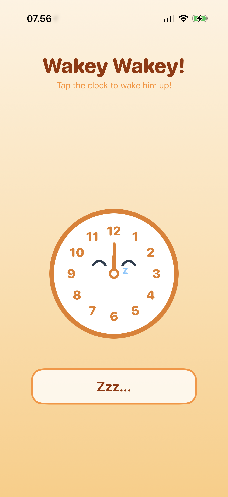
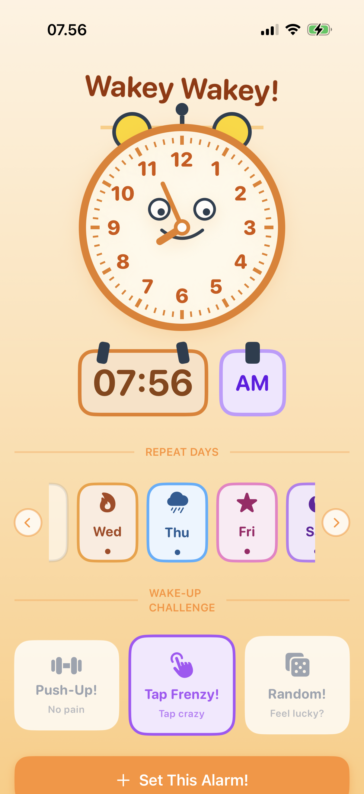
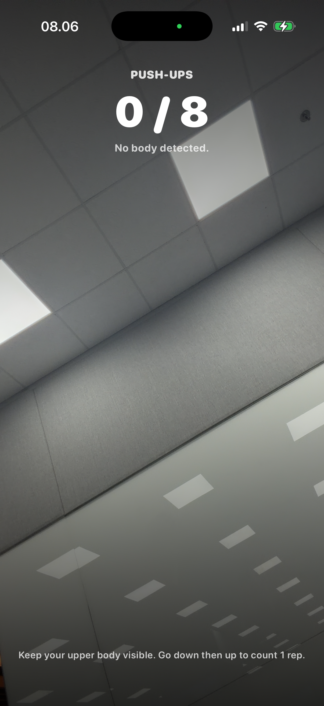

# Wake Up - AlarmKit Schedule and Alert

An iOS alarm experience built on AlarmKit, combining scheduled alarms, countdown timers, and a Live Activity countdown. The app is designed to cut through silent mode and focus, while keeping setup simple and fast.

## Highlights

- Create one-time alarms for specific dates and times.
- Schedule repeating alarms with a weekly cadence.
- Start instant timers with a clear countdown.
- Live Activity widget for ongoing countdown visibility.

## Screenshots

## Project Notes

This sample demonstrates how AlarmKit can power prominent alerts that bypass silent mode and focus when needed. It also includes a widget extension that pairs with alarms to show a custom countdown Live Activity.

> Related session: WWDC25 session 230, [Wake up to the AlarmKit API](https://developer.apple.com/wwdc25/230)
> Documentation: [Scheduling an alarm with AlarmKit](https://developer.apple.com/documentation/alarmkit/scheduling-an-alarm-with-alarmkit)
